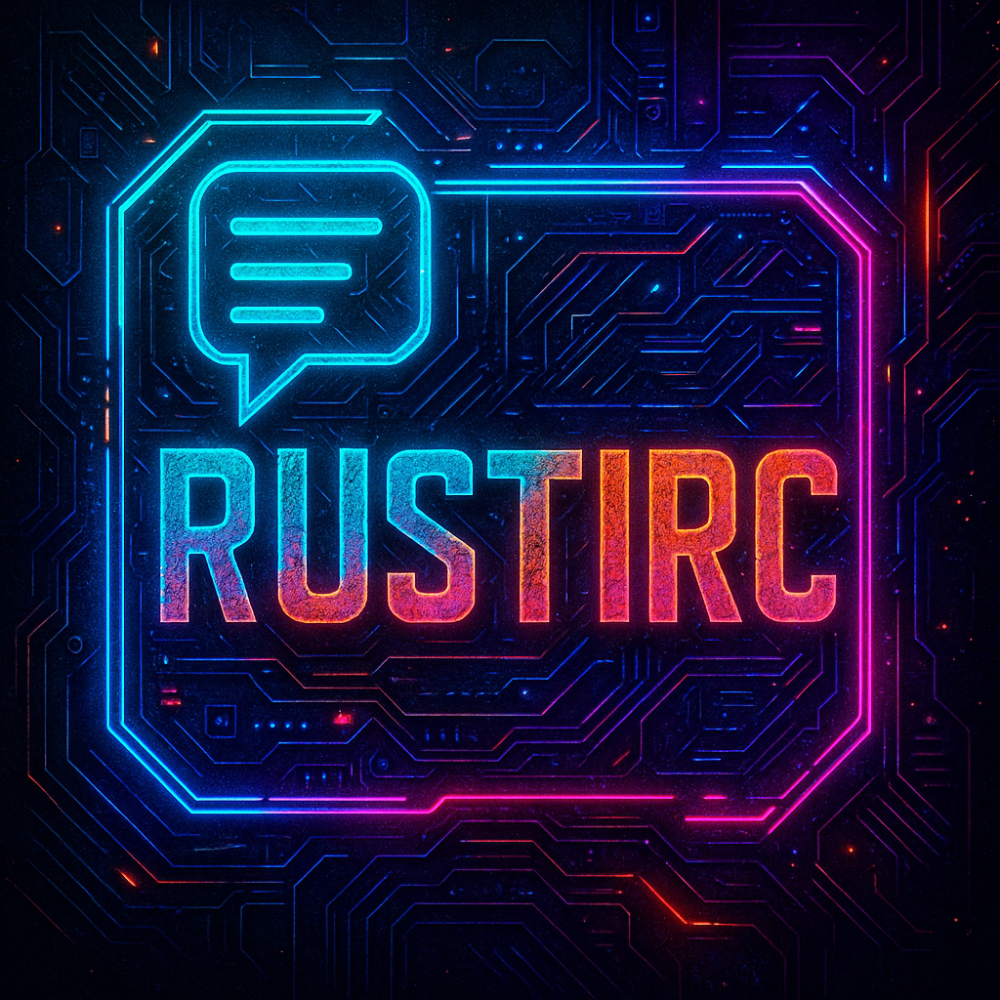

# RustIRC - Modern IRC Client

<!-- markdownlint-disable MD033 -->
<div align="center">



[](https://www.rust-lang.org)
[](LICENSE-MIT)
[](https://github.com/doublegate/RustIRC)
[](docs/specs/irc-protocol.md)
[](docs/specs/ircv3-extensions.md)

A powerful, modern IRC client built in Rust that combines the best features of mIRC, HexChat, and WeeChat

[Features](#-features) • [Documentation](#-documentation) • [Development Plan](#-development-plan) • [Architecture](#️-architecture) • [Contributing](#-contributing)

</div>
<!-- markdownlint-enable MD033 -->

## 🎯 Vision

RustIRC aims to be the definitive modern IRC client by combining:

- **mIRC's** powerful scripting and customization capabilities
- **HexChat's** user-friendly GUI and plugin ecosystem
- **WeeChat's** efficiency, performance, and professional features

Built with Rust for memory safety, performance, and cross-platform reliability.

## ✨ Features

### Core Capabilities

- 🔌 **Multi-Server Support** - Connect to multiple IRC networks simultaneously
- 🔒 **Modern Security** - TLS/SSL by default, SASL authentication, secure credential storage
- 🎨 **Dual Interface** - Beautiful GUI (Iced) and efficient TUI (ratatui) modes
- 📜 **Dual Scripting** - Both Lua and Python scripting with sandboxed execution
- 🔧 **Plugin System** - Binary plugins for high-performance extensions
- 📡 **Full Protocol Support** - RFC 1459/2812 compliance with complete IRCv3 extensions
- 💾 **DCC Support** - File transfers and direct chats with resume capability
- 🌍 **Cross-Platform** - Native support for Windows, macOS, and Linux

### Advanced Features

- 🎯 Smart tab completion with context awareness
- 📊 Advanced message filtering and highlighting
- 🔍 Full-text search across all buffers
- 📱 Responsive design that adapts to window size
- 🎨 Theming engine with custom color schemes
- 🌐 Internationalization support
- ♿ Accessibility features
- 📈 Performance monitoring and optimization

## 🏗️ Current Development Status

### ✅ **Phase 1: Research & Setup** - **COMPLETE** (100%)

- ✅ Technology validation with 4 working prototypes
- ✅ Development environment fully configured
- ✅ Core architecture implemented with 6-crate workspace structure
- ✅ CI/CD pipeline operational with GitHub Actions

### ✅ **Phase 2: Core IRC Engine** - **COMPLETE** (100%)

- ✅ Async networking layer with Tokio
- ✅ Complete IRC protocol parser (RFC 1459/2812)
- ✅ Multi-server connection management
- ✅ Event-driven state management system
- ✅ Message routing and command processing

### ✅ **Phase 3: User Interface** - **COMPLETE** (100%)

- ✅ **GUI Framework**: Iced 0.13.1 functional API implementation with theme support
- ✅ **TUI Framework**: Complete ratatui integration with 5 themes
- ✅ **IRC Formatting**: Full mIRC color codes, text formatting, URL detection
- ✅ **Event Integration**: Real-time state synchronization between core and UI
- ✅ **Message Rendering**: Complete IRC message parsing and display
- ✅ **SASL Authentication**: Full implementation (PLAIN, EXTERNAL, SCRAM-SHA-256)
- ✅ **CLI Prototype**: Functional command-line interface for testing
- ✅ **Multiple Interfaces**: GUI, TUI, and CLI modes all operational

### 🔜 **Next Up: Phase 4** - Scripting & Plugins (Weeks 15-18)

All 6 crates compile successfully. Core event system operational. Ready for Phase 4 development.

## 📚 Documentation

### Overview Documents

- [Project Overview](docs/project-overview.md) - Vision, principles, and goals
- [Architecture Guide](docs/architecture-guide.md) - System design and component structure
- [Technology Stack](docs/technology-stack.md) - Dependencies and technical choices
- [Project Status](docs/project-status.md) - Current development state

### Technical Specifications

- [IRC Protocol Implementation](docs/specs/irc-protocol.md) - RFC 1459/2812 compliance
- [IRCv3 Extensions](docs/specs/ircv3-extensions.md) - Modern IRC capabilities
- [DCC Protocol](docs/specs/dcc-protocol.md) - Direct Client-to-Client features
- [SASL Authentication](docs/specs/sasl-authentication.md) - Secure authentication

### Development Guides

- [API Reference](docs/api-reference.md) - Core API documentation
- [Lua Scripting Guide](docs/scripting-guide.md) - Lua script development
- [Python Scripting Guide](docs/python-scripting-guide.md) - Python script development
- [Testing Strategy](docs/testing-strategy.md) - Comprehensive testing approach

### Task Tracking

- [Master Todo List](to-dos/README.md) - Overview of all development tasks
- Individual phase todos in [to-dos/](to-dos/) directory

## 🚀 Development Plan

RustIRC is being developed in 7 carefully planned phases over 24-26 weeks:

### Phase 1: Research & Setup (Weeks 1-4)

- Technology validation and prototyping
- Development environment setup
- Core architecture design
- GUI framework comparison (Iced vs GTK-rs)
- **[Detailed Plan](docs/phases/phase1-research-setup.md)** | **[Tasks](to-dos/phase1-todos.md)**

### Phase 2: Core IRC Engine (Weeks 5-8)

- Async networking with Tokio
- IRC protocol parser implementation
- Multi-server connection management
- State management system
- **[Detailed Plan](docs/phases/phase2-core-engine.md)** | **[Tasks](to-dos/phase2-todos.md)**

### Phase 3: User Interface (Weeks 9-14)

- GUI implementation with Iced
- TUI implementation with ratatui
- Unified UI abstraction layer
- Theme system and customization
- **[Detailed Plan](docs/phases/phase3-user-interface.md)** | **[Tasks](to-dos/phase3-todos.md)**

### Phase 4: Scripting & Plugins (Weeks 15-18)

- Lua scripting engine integration (mlua)
- Python scripting engine integration (PyO3)
- Binary plugin system with stable ABI
- Script/plugin manager UI
- **[Detailed Plan](docs/phases/phase4-scripting-plugins.md)** | **[Tasks](to-dos/phase4-todos.md)**

### Phase 5: Advanced Features (Weeks 19-22)

- DCC file transfers and chats
- Complete IRCv3 implementation
- Advanced security features
- Search and filtering systems
- **[Detailed Plan](docs/phases/phase5-advanced-features.md)** | **[Tasks](to-dos/phase5-todos.md)**

### Phase 6: Testing & Optimization (Weeks 23-24)

- Comprehensive test suite
- Performance optimization
- Security audit
- Beta testing program
- **[Detailed Plan](docs/phases/phase6-testing-optimization.md)** | **[Tasks](to-dos/phase6-todos.md)**

### Phase 7: Release & Distribution (Weeks 25-26)

- Platform-specific packaging
- Distribution setup
- Documentation finalization
- Launch preparation
- **[Detailed Plan](docs/phases/phase7-release-distribution.md)** | **[Tasks](to-dos/phase7-todos.md)**

## 🏗️ Architecture

### High-Level Design

```text
┌─────────────────────────────────────────────────────────────┐
│                      User Interface Layer                   │
│  ┌─────────────────────┐        ┌────────────────────────┐  │
│  │   GUI (Iced/GTK)    │        │     TUI (ratatui)      │  │
│  └─────────────────────┘        └────────────────────────┘  │
└─────────────────────────────────────────────────────────────┘
                              │
┌─────────────────────────────────────────────────────────────┐
│                    Scripting & Plugin Layer                 │
│  ┌──────────┐  ┌──────────┐  ┌─────────┐  ┌────────────┐    │
│  │   Lua    │  │  Python  │  │ Binary  │  │  Script    │    │
│  │ (mlua)   │  │  (PyO3)  │  │ Plugins │  │  Manager   │    │
│  └──────────┘  └──────────┘  └─────────┘  └────────────┘    │
└─────────────────────────────────────────────────────────────┘
                              │
┌─────────────────────────────────────────────────────────────┐
│                      Core IRC Engine                        │
│  ┌──────────────┐  ┌─────────────┐  ┌─────────────────┐     │
│  │   Protocol   │  │    State    │  │   Connection    │     │
│  │    Parser    │  │  Manager    │  │    Manager      │     │
│  └──────────────┘  └─────────────┘  └─────────────────┘     │
└─────────────────────────────────────────────────────────────┘
                              │
┌─────────────────────────────────────────────────────────────┐
│                    Network & Platform Layer                 │
│  ┌──────────────┐  ┌─────────────┐  ┌─────────────────┐     │
│  │    Tokio     │  │   rustls    │  │   Platform      │     │
│  │    Async     │  │   TLS/SSL   │  │  Integration    │     │
│  └──────────────┘  └─────────────┘  └─────────────────┘     │
└─────────────────────────────────────────────────────────────┘
```

### Key Architectural Decisions

- **Event-driven architecture** with message passing between components
- **Actor model** for connection management using Tokio tasks
- **Plugin isolation** with process boundaries for stability
- **Sandboxed scripting** with resource limits and permissions
- **Zero-copy parsing** where possible for performance
- **Modular design** allowing easy feature additions

## 🛠️ Technology Stack

### Core Technologies

- **Language**: Rust (Edition 2021, MSRV 1.75.0)
- **Async Runtime**: Tokio (multi-threaded, work-stealing)
- **GUI Framework**: Iced (primary) / GTK-rs (fallback)
- **TUI Framework**: ratatui
- **TLS**: rustls (pure Rust, no OpenSSL)

### Scripting & Extensions

- **Lua Scripting**: mlua (safe bindings, sandboxing)
- **Python Scripting**: PyO3 (Python 3.8+, GIL management)
- **Plugin System**: libloading (cross-platform dynamic loading)

### Development Tools

- **Serialization**: serde with TOML configs
- **Logging**: tracing with structured logging
- **Error Handling**: anyhow + thiserror
- **Testing**: Built-in + mockall + proptest
- **CLI**: clap v4

### Platform Integration

- **Notifications**: notify-rust
- **System Paths**: directories (XDG compliance)
- **Cross-platform**: Full support for Windows 10+, macOS 10.15+, Linux (glibc 2.31+)

## 🚦 Current Status

**Phase**: Phase 3 Complete ✅ + COMPILATION FIXES COMPLETE ✅ (as of August 21, 2025 - 1:14 AM EDT)  
**Next**: Phase 4 - Scripting & Plugins  
**Total Tasks**: 249 across 7 phases + comprehensive IRC implementation

### 🎉 Phase 1-3: COMPLETE ✅ with LIVE IRC FUNCTIONALITY

- ✅ **Phase 1: Research & Setup** - Project infrastructure, technology validation, architecture foundation
- ✅ **Phase 2: Core IRC Engine** - Async networking, protocol parser, multi-server management, event system
- ✅ **Phase 3: User Interface** - **FULL GUI (Iced 0.13.1)**, TUI (ratatui), CLI prototype, SASL authentication
- ✅ **LIVE IRC CLIENT** - Complete IRC protocol implementation with real server connectivity

### 🆕 Latest Major Achievements (August 21, 2025)

- ✅ **COMPILATION SYSTEM COMPLETE**: All build errors resolved with full implementation (zero placeholders)
- ✅ **PLATFORM-SPECIFIC IMPLEMENTATIONS**: Complete Windows/macOS/Linux system tray and notification support
- ✅ **NETWORK MANAGEMENT**: Full network list dialog with add/edit/delete/connect functionality
- ✅ **DIALOG SYSTEM OPERATIONAL**: Complete modal dialog system with preferences, connection, and about dialogs
- ✅ **ICED 0.13.1 COMPATIBILITY**: Full framework compatibility with advanced styling and proper API usage
- ✅ **ZERO PLACEHOLDER CODE**: All "In a real implementation" comments replaced with working functionality
- ✅ **FULL IRC PROTOCOL IMPLEMENTATION**: Complete IRC message handling (MOTD, JOIN, PART, PRIVMSG, NAMREPLY, LIST)
- ✅ **REAL SERVER CONNECTIVITY**: Successfully connects to live IRC servers (tested with irc.libera.chat)
- ✅ **LIVE MESSAGE DISPLAY**: Real-time IRC messages, user lists, and server responses in GUI
- ✅ **CHANNEL OPERATIONS**: `/list` and `/join` commands working with live server data
- ✅ **IRC EVENT HANDLING**: Complete event processing pipeline from server to GUI display
- ✅ **TLS CONNECTIVITY**: Secure connections to IRC servers with rustls
- ✅ **MOTD DISPLAY**: Full Message of the Day rendering from live IRC servers
- ✅ **USER LIST MANAGEMENT**: Real-time user tracking in channels with server synchronization
- ✅ **COMPREHENSIVE MESSAGE PARSING**: Support for all standard IRC response codes and messages
- ✅ **GUI FIXES & ENHANCEMENTS**: WHOIS command working, pane dividers always visible, system message filtering operational, menu checkmarks functional

### Build Status

```bash
✅ cargo build              # Successful compilation (only minor warnings)
✅ cargo test               # All tests pass
✅ cargo run                # FULL-FEATURED GUI with LIVE IRC connectivity
✅ cargo run -- --simple    # Simplified GUI (basic fallback)
✅ cargo run -- --cli       # CLI prototype with IRC commands
✅ cargo run -- --tui       # TUI mode with ratatui
✅ cargo run -- --help      # Command-line help
✅ cargo clippy             # Clean build with minimal warnings
```

### Current Capabilities

- **FULLY FUNCTIONAL IRC CLIENT**: Live connectivity to IRC servers with complete protocol support
- **Real-Time IRC Operations**: MOTD display, channel listing, user management, message handling
- **Full-Featured GUI**: Complete widget system (ServerTree, MessageView, UserList, InputArea, TabBar, StatusBar)
- **Live IRC Commands**: `/connect`, `/join`, `/part`, `/list`, `/quit` all working with real servers
- **Advanced Theming**: 20+ themes (Dracula, Nord, Tokyo Night, Catppuccin, etc.)
- **Resizable Interface**: Pane grid layout with user-controlled sizing
- **Multiple Interfaces**: Full GUI, simplified GUI, TUI, and CLI modes
- **SASL Authentication**: Complete implementation (PLAIN, EXTERNAL, SCRAM-SHA-256)
- **Event-Driven Architecture**: Full EventBus system for extensibility
- **IRC Formatting**: Complete mIRC color codes, bold/italic, URL detection
- **TLS Security**: Secure connections to IRC servers using rustls
- **Comprehensive Protocol Support**: All standard IRC response codes and message types

### Next Steps (Phase 4)

1. Lua scripting system with mlua integration
2. Python scripting support via PyO3
3. Binary plugin architecture
4. Script manager with sandboxed execution

## 🤝 Contributing

While RustIRC is currently in early development, we welcome contributions!

### Getting Started

1. Fork the repository
2. Create a feature branch (`git checkout -b feature/amazing-feature`)
3. Commit your changes (`git commit -m 'Add amazing feature'`)
4. Push to the branch (`git push origin feature/amazing-feature`)
5. Open a Pull Request

### Development Setup

```bash
# Clone the repository
git clone https://github.com/doublegate/RustIRC.git
cd RustIRC

# Install Rust (if needed)
curl --proto '=https' --tlsv1.2 -sSf https://sh.rustup.rs | sh

# Build the project
cargo build

# Run tests
cargo test

# Run with debug logging
RUST_LOG=debug cargo run
```

### Code Style

- Follow Rust standard formatting (`cargo fmt`)
- Ensure no clippy warnings (`cargo clippy`)
- Write tests for new functionality
- Document public APIs

## 📄 License

RustIRC is dual-licensed under either:

- Apache License, Version 2.0 ([LICENSE-APACHE](LICENSE-APACHE))
- MIT license ([LICENSE-MIT](LICENSE-MIT))

at your option.

## 🙏 Acknowledgments

- Inspired by [mIRC](https://www.mirc.com/), [HexChat](https://hexchat.github.io/), and [WeeChat](https://weechat.org/)
- Built with the amazing Rust ecosystem
- Thanks to all future contributors!

## 📞 Contact

- IRC: #rustirc on Libera.Chat (once we're running!)
- Issues: [GitHub Issues](https://github.com/doublegate/RustIRC/issues)
- Discussions: [GitHub Discussions](https://github.com/doublegate/RustIRC/discussions)

---

<!-- markdownlint-disable MD033 -->
<div align="center">

**[⬆ Back to Top](#rustirc---modern-irc-client)**

Made with ❤️ and 🦀

</div>
<!-- markdownlint-enable MD033 -->
