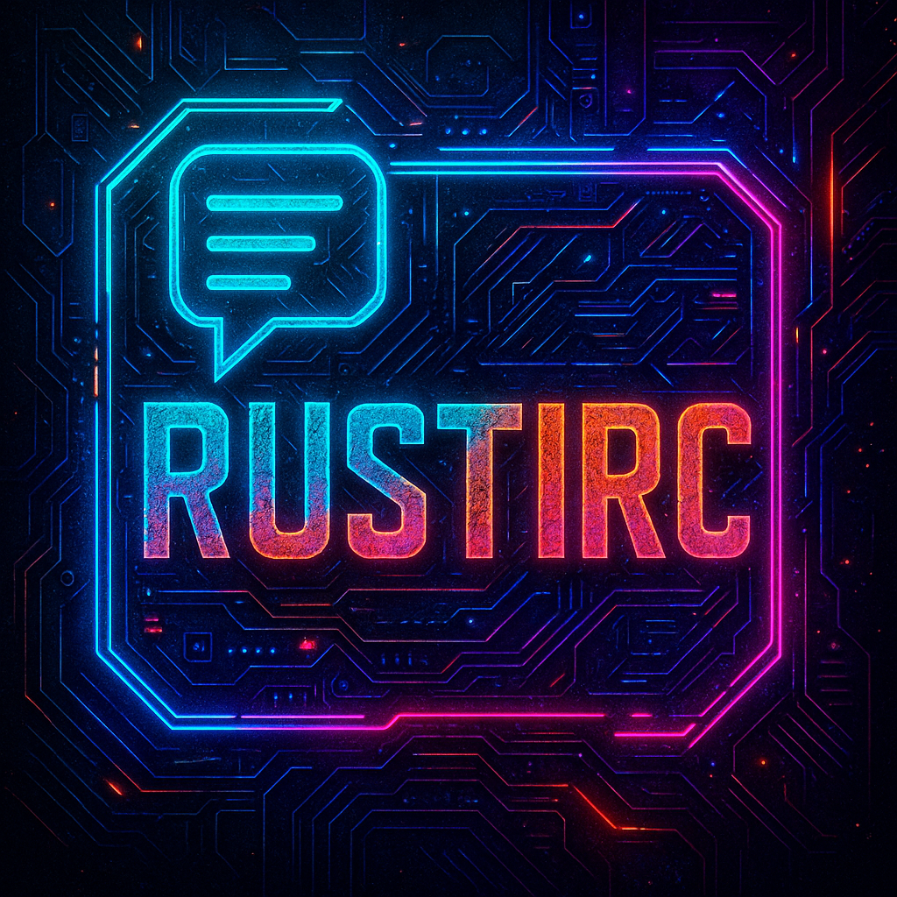

# RustIRC - Modern IRC Client

<!-- markdownlint-disable MD033 -->
<div align="center">



[](CHANGELOG.md)
[](https://www.rust-lang.org)
[](LICENSE-MIT)
[](.github/workflows/ci.yml)
[](docs/api-reference.md)
[](docs/api-reference.md)
[](https://github.com/doublegate/RustIRC)
[](docs/specs/irc-protocol.md)
[](docs/specs/ircv3-extensions.md)
[](docs/architecture-guide.md)
[](scripts/README.md)

A powerful, modern IRC client built in Rust with a Dioxus reactive GUI and comprehensive Lua scripting

**Last Updated**: 2026-03-07 | **Branch**: dioxus - v0.5.0 Dioxus GUI Migration

[Features](#features) | [Documentation](#documentation) | [Architecture](#architecture) | [Contributing](#contributing)

</div>
<!-- markdownlint-enable MD033 -->

## Vision

RustIRC aims to be the definitive modern IRC client by combining:

- **mIRC's** powerful scripting and customization capabilities
- **HexChat's** user-friendly GUI and plugin ecosystem
- **WeeChat's** efficiency, performance, and professional features

Built with Rust for memory safety, performance, and cross-platform reliability.

## Features

### Core Capabilities

- **Multi-Server Support** - Connect to multiple IRC networks simultaneously
- **Modern Security** - TLS/SSL by default, SASL authentication, secure credential storage
- **Dual Interface** - Dioxus GUI (desktop + web) and ratatui TUI modes
- **Lua Scripting** - Complete Lua 5.4 scripting with sandboxed execution, event hooks, and custom commands
- **Plugin System** - Trait-based plugin architecture with built-in Logger and Highlight plugins
- **Full Protocol Support** - RFC 1459/2812 compliance with IRCv3 batch, CHATHISTORY, labeled-response
- **DCC Support** - File transfers (SEND/RESUME) and direct chats with progress tracking
- **Flood Protection** - Token bucket rate limiting with configurable burst and queue
- **Proxy Support** - SOCKS5 and HTTP CONNECT proxy with authentication
- **Cross-Platform** - Native desktop (Windows, macOS, Linux) + web target
- **22 Themes** - Dark, Light, Dracula, Nord, Tokyo Night, Catppuccin, and 16 more via CSS custom properties

### Advanced Features

- Smart tab completion with context awareness
- Advanced message filtering and highlighting
- Full-text search across all buffers
- Responsive design that adapts to window size
- IRC color code rendering with styled HTML spans
- Accessibility features

## Latest Release

**Version 0.5.0** - Dioxus 0.7.3 + Axum GUI Migration

### Major Changes in v0.5.0

- **GUI Framework Migration**: Replaced iced 0.14.0 with Dioxus 0.7.3
- **Reactive Signal Architecture**: `Signal<AppState>` with automatic re-rendering
- **CSS Theme System**: 22 themes as CSS custom properties (`[data-theme="..."]` selectors)
- **Tailwind CSS Styling**: Zero-config Tailwind integration in RSX components
- **Web Target**: Fullstack Axum support via `#[server]` functions
- **Desktop + Web**: Same codebase targets native desktop (Blitz/WGPU) and web browsers
- **Component Architecture**: 18 RSX components replacing iced widget monolith
- **IRC Formatting**: mIRC color codes rendered as CSS-styled `<span>` elements
- **EventBus Bridge**: `use_coroutine()` bridges core EventBus to reactive Dioxus signals

### Preserved from v0.4.x

- All 254 workspace tests passing (233 unit + 14 state + 5 formatting + 6 theme)
- Lua scripting engine with 50+ IRC API functions
- Plugin system with Logger and Highlight plugins
- DCC protocol (CHAT, SEND, RESUME)
- IRCv3 batch, CHATHISTORY, labeled-response
- Flood protection, proxy support, notification rules
- TUI mode (ratatui) unchanged

## Architecture

### Dioxus Reactive GUI Architecture

```text
+-------------------------------------------------------------+
|             Dioxus 0.7.3 Reactive GUI Layer                  |
|  +----------------------------------------------------------+|
|  |  RSX Components (18 total)                                ||
|  |  +- Layout (3-pane flexbox)                               ||
|  |  +- TabBar, ServerTree, UserList                          ||
|  |  +- MessageView, InputArea, SearchBar                     ||
|  |  +- Dialogs (Connect, Preferences, About)                ||
|  |  +- DCC (Transfer, Chat), ScriptConsole, PluginManager   ||
|  +----------------------------------------------------------+|
|  +----------------------------------------------------------+|
|  |  Signal<AppState> + Hooks                                 ||
|  |  +- use_irc_event_handler (EventBus coroutine)            ||
|  |  +- IrcActions (connect, send, join, leave)               ||
|  |  +- use_theme (22 CSS themes)                             ||
|  +----------------------------------------------------------+|
|  +----------------------------------------------------------+|
|  |  CSS Themes (Tailwind + Custom Properties)                ||
|  |  +- 22 themes via [data-theme="..."] selectors            ||
|  |  +- IRC color classes (.irc-color-0 through .irc-color-15)||
|  +----------------------------------------------------------+|
+-------------------------------------------------------------+
                              |
+-------------------------------------------------------------+
|                    Scripting & Plugin Layer                   |
|  +----------+  +----------+  +---------+  +------------+    |
|  |   Lua    |  |  Python  |  | Binary  |  |  Script    |    |
|  | (mlua)   |  |  (PyO3)  |  | Plugins |  |  Manager   |    |
|  +----------+  +----------+  +---------+  +------------+    |
+-------------------------------------------------------------+
                              |
+-------------------------------------------------------------+
|                      Core IRC Engine                         |
|  +--------------+  +-------------+  +-----------------+     |
|  |   Protocol   |  |    State    |  |   Connection    |     |
|  |    Parser    |  |  Manager    |  |    Manager      |     |
|  +--------------+  +-------------+  +-----------------+     |
+-------------------------------------------------------------+
                              |
+-------------------------------------------------------------+
|                    Network & Platform Layer                   |
|  +--------------+  +-------------+  +-----------------+     |
|  |    Tokio     |  |   rustls    |  |   Platform      |     |
|  |    Async     |  |   TLS/SSL   |  |  Integration    |     |
|  +--------------+  +-------------+  +-----------------+     |
+-------------------------------------------------------------+
```

### State Bridge Pattern

```
rustirc-core EventBus (tokio mpsc)
    -> use_coroutine() listens for Event variants
    -> Updates Signal<AppState> on each event
    -> Components read signals reactively (auto re-render)
    -> User actions call rustirc-core methods directly
```

### Key Architectural Decisions

- **Event-driven architecture** with message passing between components
- **Signal-based reactivity** for automatic UI updates
- **Actor model** for connection management using Tokio tasks
- **Plugin isolation** with process boundaries for stability
- **Sandboxed scripting** with resource limits and permissions
- **CSS custom properties** for zero-runtime theme switching
- **Modular design** allowing easy feature additions

## Technology Stack

### Core Technologies

- **Language**: Rust (Edition 2021, MSRV 1.80.0)
- **Async Runtime**: Tokio (multi-threaded, work-stealing)
- **GUI Framework**: Dioxus 0.7.3 with fullstack support
  - Blitz/WGPU native desktop renderer
  - Axum-based web server for fullstack target
  - Tailwind CSS with zero-config integration
  - Hot-patching development with `dx serve`
- **TUI Framework**: ratatui
- **TLS**: rustls (pure Rust, no OpenSSL)

### Scripting & Extensions

- **Lua Scripting**: mlua with Lua 5.4 (production-ready, sandboxed, 50+ IRC API functions)
- **Python Scripting**: PyO3 (planned)
- **Plugin System**: Trait-based `PluginApi` with built-in Logger and Highlight plugins

### Development Tools

- **Serialization**: serde with TOML configs
- **Logging**: tracing with structured logging
- **Error Handling**: anyhow + thiserror
- **Testing**: Built-in + mockall + proptest
- **CLI**: clap v4

## Current Status

**Version**: 0.5.0 - Dioxus GUI Migration
**Build Status**: All 6 crates compile successfully, 254 tests passing
**Clippy**: Zero warnings with `-D warnings`

### Build & Run

```bash
# Build the project
cargo build
cargo build --release

# Run the client
cargo run                    # GUI mode (Dioxus desktop)
cargo run -- --cli          # CLI prototype mode
cargo run -- --tui          # TUI mode with ratatui

# Run tests
cargo test --workspace       # 254 tests

# Code quality
cargo fmt --check && cargo clippy -- -D warnings

# Documentation
cargo doc --open
```

### Feature Flags (rustirc-gui crate)

```toml
[features]
default = ["desktop"]
desktop = ["dioxus/desktop"]     # Native desktop window
server  = ["dioxus/server"]      # Axum SSR server
web     = ["dioxus/web"]         # WASM web client
```

## Contributing

Contributions welcome! See [CONTRIBUTING.md](CONTRIBUTING.md) for details.

### Development Setup

```bash
git clone https://github.com/doublegate/RustIRC.git
cd RustIRC
cargo build
cargo test
```

### Code Style

- Follow Rust standard formatting (`cargo fmt`)
- Ensure no clippy warnings (`cargo clippy -- -D warnings`)
- Write tests for new functionality
- Document public APIs

## Documentation

- [Project Overview](docs/project-overview.md)
- [Architecture Guide](docs/architecture-guide.md)
- [Technology Stack](docs/technology-stack.md)
- [IRC Protocol](docs/specs/irc-protocol.md)
- [IRCv3 Extensions](docs/specs/ircv3-extensions.md)
- [DCC Protocol](docs/specs/dcc-protocol.md)
- [SASL Authentication](docs/specs/sasl-authentication.md)
- [Lua Scripting Guide](scripts/README.md)
- [API Reference](docs/api-reference.md)

## License

RustIRC is dual-licensed under either:

- Apache License, Version 2.0 ([LICENSE-APACHE](LICENSE-APACHE))
- MIT license ([LICENSE-MIT](LICENSE-MIT))

at your option.

## Acknowledgments

- Inspired by [mIRC](https://www.mirc.com/), [HexChat](https://hexchat.github.io/), and [WeeChat](https://weechat.org/)
- Built with the Rust ecosystem and Dioxus framework
- Thanks to all contributors!

---

<!-- markdownlint-disable MD033 -->
<div align="center">

**[Back to Top](#rustirc---modern-irc-client)**

</div>
<!-- markdownlint-enable MD033 -->
